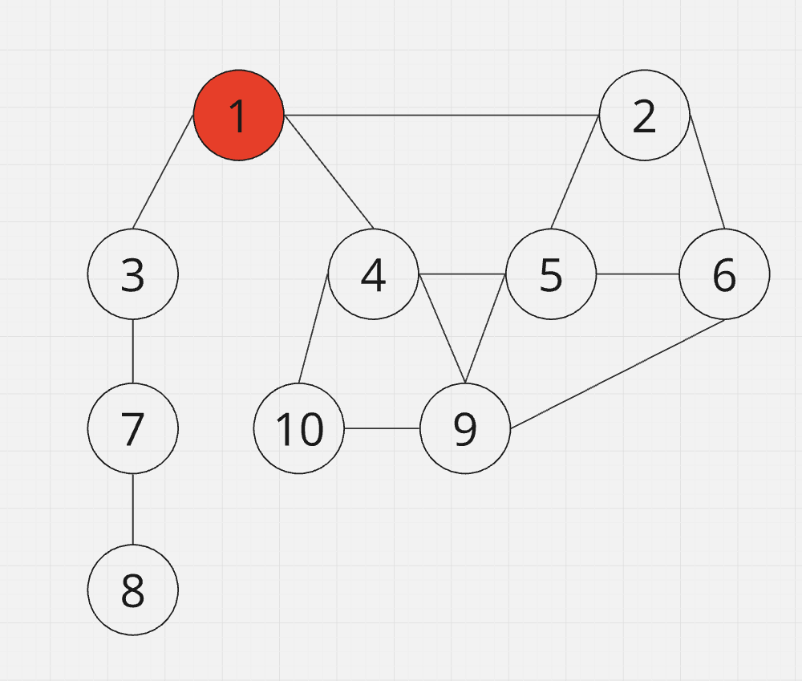
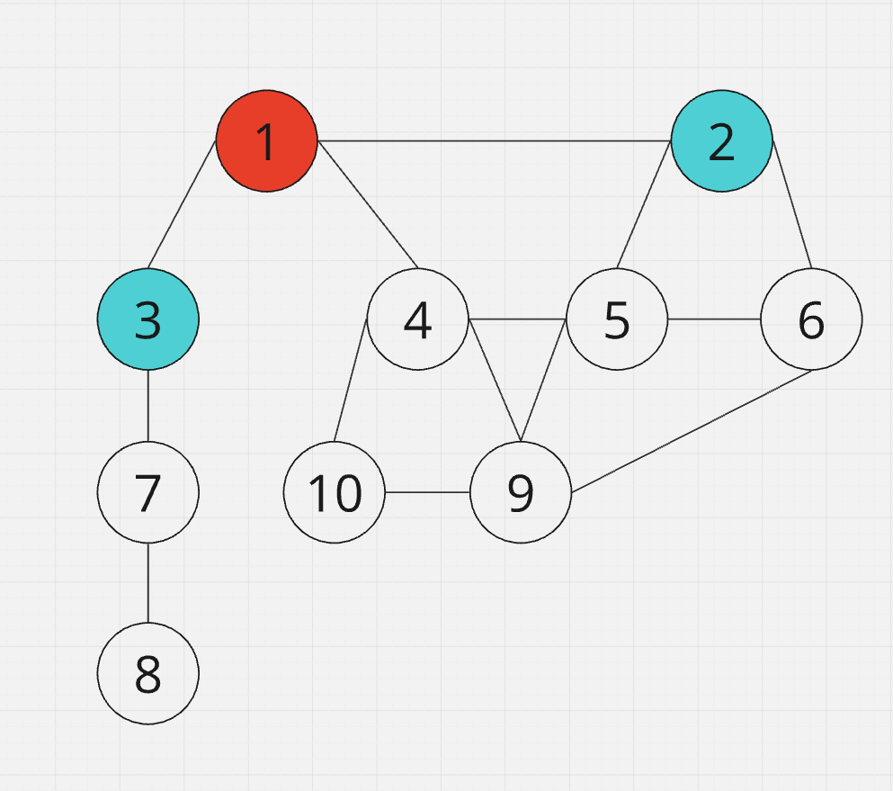
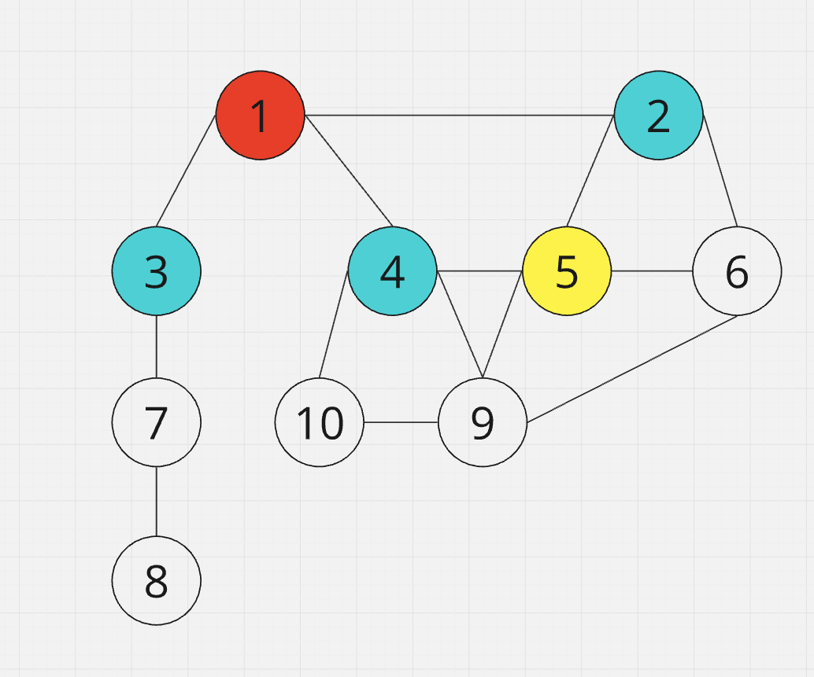
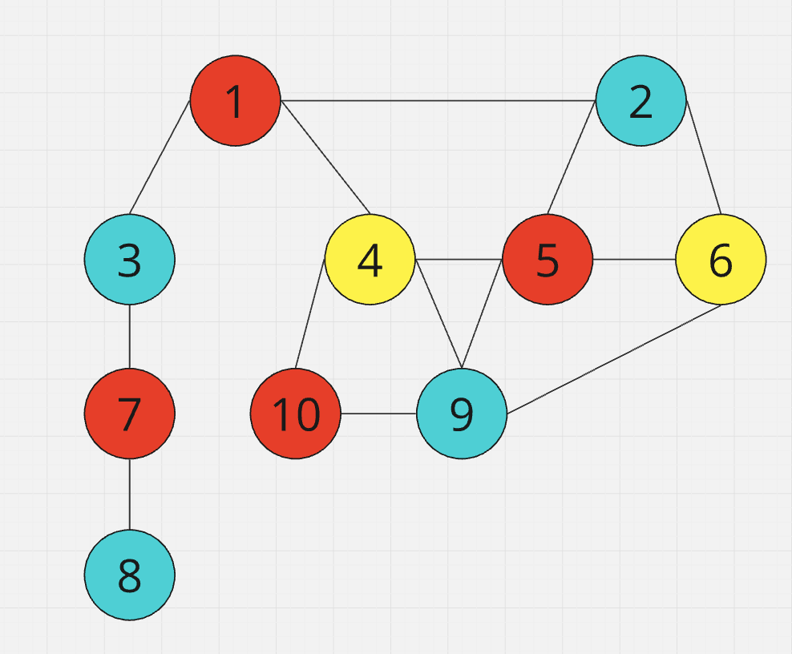

# project1-1-CS03-graph-color
 
This project implements 2 algorithms to calculate the **chromatic number** of a graph. The chromatic number is the minimum number of colors required to color the vertices of a graph such that no two adjacent vertices share the same color.

# What is Chromatic Number?
The chromatic number of a graph G, denoted as χ(G), is the minimum number of colors required to color the vertices of a graph G in such a way that no two adjacent vertices share the same color. Formally, it is the smallest positive integer k for which there exists a proper vertex coloring with k colors.

- The chromatic number is an essential parameter that captures the inherent colorability of a graph.
- It provides insights into the structural properties and relationships within the graph.

## Examples:
graph:
```
        (1)----(2)
        / \     / \
      (3)  (4)-(5)-(6)
       |    /\  | /
      (7)(10)-(9)
       |    
      (8)
```
This is the adjacency matrix representing the graph:

|   | 1 | 2 | 3 | 4 | 5 | 6 | 7 | 8 | 9 | 10 |
|---|---|---|---|---|---|---|---|---|---|---|
| 1 | 0 | 1 | 1 | 1 | 0 | 0 | 0 | 0 | 0 | 0 |
| 2 | 1 | 0 | 0 | 0 | 1 | 1 | 0 | 0 | 0 | 0 |
| 3 | 1 | 0 | 0 | 0 | 0 | 0 | 1 | 0 | 0 | 0 |
| 4 | 1 | 0 | 0 | 0 | 1 | 0 | 0 | 0 | 1 | 1 |
| 5 | 0 | 1 | 0 | 1 | 0 | 1 | 0 | 0 | 1 | 0 |
| 6 | 0 | 1 | 0 | 0 | 1 | 0 | 0 | 0 | 1 | 0 |
| 7 | 0 | 0 | 1 | 0 | 0 | 0 | 0 | 1 | 0 | 0 |
| 8 | 0 | 0 | 0 | 0 | 0 | 0 | 1 | 0 | 0 | 0 |
| 9 | 0 | 0 | 0 | 1 | 1 | 1 | 0 | 0 | 0 | 1 |
| 10 | 0 | 0 | 0 | 1 | 0 | 0 | 0 | 0 | 1 | 0 |
    
# Algorithm to find Chromatic Number of a graph.

## 1.Using Backtracking Algorithm (exact algorithm)
### Follow the given steps

1. Translate the graph.txt into a graph matrix.
2. Create a recursive function that takes graph, current vertex, colour set and current color.
3. If the current vertex is last vertex of the graph, print the chromatic number of the graph.
4. Assign a color to a vertex from range 1 to n.
    - For every assigned color, check the configuration is safe (there is no neighbor vertices that have the same colour) and recursively call the function with the next vertex and the graph.
    - If any recursive function return true then break the loop and return true.
    - If recursive function false, assign the current vertex with different colour and recursively call the function again.

### Examples:




# 2. Using Welsh-Powell Algorithm
### Follow the given steps

1. Convert the graph.txt into a vertices and edges class.
2. Find the degree of each vertex
3. List the vertices in the ascending order of their degrees
4. Colour the vertex at the top of the list with colour 1
5. Continue down the list, colouring each vertex that is not connected to any other vertex with that colour
6. Redo step 5 but with the next colour, do this until each vertex is coloured
7. Once each vertex is coloured, the estimated chromatic number will be the colour variable minus 1

# How to run the code?
Run these lines in the command prompt
```
javac ReadGraph.java
java ReadGraph "filename that contains graph"
```
## Example:
```
>> javac ReadGraph.java
>> java ReadGraph graph.txt
// Number of vertices = 6
// Expected number of edges = 7
// Reading edge 1
// Edge: 1 2
// Reading edge 2
// Edge: 2 3
// Reading edge 3
// Edge: 3 1
// Reading edge 4
// Edge: 1 4
// Reading edge 5
// Edge: 4 5
// Reading edge 6
// Edge: 5 6
// Reading edge 7
// Edge: 6 4
Chromatic Number: 3
```


